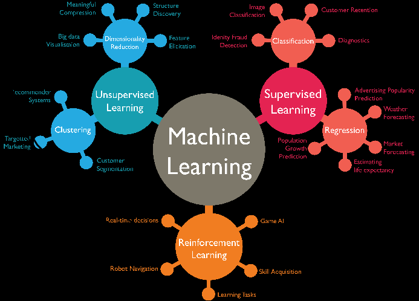

# Contenido

* [Introducción](#Introducción)

* [Problema](#Problema)

* [Propuesta](#Propuesta)

* [Datasets](#Datasets)

* [Modelo Similitud del Coseno](#Modelo-Similitud-del-Coseno)

* [API's](#Api's)

* [Glosario](#Glosario)

* [Recursos](#Recursos)

* [Créditos](#Créditos)

# Introducción
El Machine Learning, o Aprendizaje Automático, ha revolucionado la tecnología actual, impulsando la innovación en diversos campos. Es una rama de la Inteligencia Artificial que dota a las máquinas de la capacidad de aprender y mejorar su rendimiento de forma autónoma, sin necesidad de programación explícita.

Existen tres tipos principales de Machine Learning:
•	Aprendizaje Supervisado
•	Aprendizaje No Supervisado
•	Aprendizaje por Refuerzo

Machine Learning está transformando diversos sectores : Salud, Finanzas, Marketing, Manufactura, Transporte, y seguirá evolucionando a pasos agigantados, impulsado por el aumento de datos disponibles, el desarrollo de algoritmos más potentes y la mayor accesibilidad a la computación en la nube. Se espera que tenga un impacto aún mayor en la sociedad, mejorando la calidad de vida y creando nuevas oportunidades en diversos campos.

Descripción del Problema y Propuesta

# Problema

Se nos presenta un conjunto de datos historicos de juegos, con el objetivo de crear un sistema de recomendación de juegos mediante Machine Learning. El dataset presenta algunas inconsistencias y requiere de preprocesamiento para su correcto uso. Además, se busca desarrollar una API RESTful para consumir los datos y los resultados del sistema de recomendación.

# Propuesta

Se propone un plan de trabajo dividido en las siguientes etapas:

## Preprocesamiento de Datos

**Limpieza de datos**: Eliminar columnas irrelevantes y manejar valores faltantes.
**Análisis de Sentimiento**: Implementar un análisis de sentimiento en la columna "user_reviews.review" para clasificar las reseñas como positivas, neutrales o negativas.

## Desarrollo de la API:

**API RESTful**: Utilizar el framework FastAPI para crear una API RESTful que permita consultar los datos del dataset y las recomendaciones del sistema de Machine Learning.

## Análisis Exploratorio de Datos (EDA):

**Exploración de variables**: Analizar las relaciones entre las variables del dataset, identificar outliers y patrones interesantes.
**Visualización de datos**: Crear visualizaciones como nubes de palabras para comprender la distribución de palabras en los títulos de los juegos.

## Modelo de Aprendizaje Automático:

**Selección del modelo**: Elegir entre las dos propuestas de sistema de recomendación: ítem-ítem o user-item.
**Entrenamiento del modelo**: Entrenar el modelo de Machine Learning utilizando la técnica de **similitud del coseno** para la recomendación ítem-ítem o algoritmos de filtrado colaborativo para la recomendación user-item.
**Evaluación del modelo**: Evaluar el rendimiento del modelo mediante métricas adecuadas.

## Implementación del Modelo en la API:

**Integración del modelo**: Integrar el modelo de Machine Learning entrenado en la API para que las consultas puedan generar recomendaciones.
**Formato de salida**: Definir un formato de salida estandarizado para las recomendaciones, similar al ejemplo proporcionado.

## Despliegue de la API:

**Utilización de Render o Railway**: Utilizar una plataforma de despliegue como Render o Railway para alojar la API y hacerla accesible en la web.

## Consideraciones adicionales:

* Documentar el código y la API de manera clara y detallada.
* Implementar pruebas unitarias para garantizar el correcto funcionamiento del código.
* Considerar la escalabilidad de la API para manejar un mayor volumen de datos y tráfico.

## Dataset

El dataset que se presenta a continuación contiene información sobre reseñas de juegos realizadas por usuarios. Esta valiosa colección de datos ofrece una oportunidad única para comprender las preferencias de los jugadores, identificar patrones en las reseñas y desarrollar sistemas de recomendación de juegos más efectivos.

Los datasets pasaran por un proceso ETL, con el propósito de limpiar, transformar y preparar los datos para su análisis posterior. El Análisis Exploratorio de Datos (EDA) se enfocará en explorar las relaciones entre las variables, identificar patrones y obtener una comprensión profunda de las características de las reseñas y los juegos.

### user_review.parquet: Contiene las siguientes atributos o columnas:

* user_id             :  identificador del usuario
* item_id             :  identificador del juego o producto
* recommend           :  Recomendacion positiva o negativa por parte del usuario
* review              :  opinion del jugador dada al juego
* sentiment_analysis  :  un valor dado al juego (0 = malo, 1 = neutral, 2 = positivo)

### developer.parquet: Contiene las siguientes atributos o columnas:

* year                :  año de publicacion          
* item_id             :  identificador del juego o producto
* price               :  precio del juego
* developer           :  empresa desarrolladora

### sentiment_analysis.parquett: Contiene las siguientes atributos o columnas:

* user_id             :  identificador del usuario
* item_id             :  identificador del juego o producto
* recommend           :  Recomendacion positiva o negativa por parte del usuario
* review              :  opinion del jugador dada al juego
* sentiment_analysis  :  un valor dado al juego (0 = malo, 1 = neutral, 2 = positivo)
* item_name           :  nombre del juego o producto

### users_items.parquet: Contiene las siguientes atributos o columnas:

* genres              :  genero al que pertenece el juego o producto
* title               :  titulo del juego o producto
* year                :  año de publicacion
* price               :  precio del juego
* developer           :  empresa desarrolladora
* item_id             :  identificador del juego o producto

# Modelo Similitud del Coseno

Es una herramienta interesante que podemos utilizar en el análisis de grafos. Este se encarga de conocer el ángulo entre dos vectores n-dimensionales en un espacio n-dimensional. Esto siginifica que el resultado que obtenemos es el **producto escalar de los dos vectores dividido por el producto de las longitudes o magnitudes de los dos vectores**.

Dentro de la similitud de coseno dos vectores con la misma orientación tienen una similitud de coseno de 1 , dos vectores orientados a 90° entre sí tienen una similitud de 0, y dos vectores diametralmente opuestos tienen una similitud de -1, independientemente de su magnitud.

Como debemos implementarlo en nuestro codigo

```bash
from sklearn.feature_extraction.text import TfidfVectorizer
from sklearn.metrics.pairwise import cosine_similarity
```
Instanciamos la clase TfidfVectorizer, luego entrena y aplica la transformacion.

```bash
vectorizer = TfidfVectorizer()
tfidf_matrix = vectorizer.fit_transform(df_sentiment_analysis["review"])
```
En el proceso de analisis podemos observar a traves de una nube de palabras los mas jugados


# Api

<h4 align="center">
:construction: Tema en desarrollo :construction:
</h4>

La Api


developer

Para probar ingrese :

Valve


Respuesta


userdata

Para probar ingrese :

Walker1183 <br>
farnellthedog


Respuesta


recomendacion por juego

Para probar ingrese :

11610 <br>
25000


Respuesta


recomendacion por usuario

Para probar ingrese :

Killyis <br>
farnellthedog


Respuesta


[Vamos a este enlace para ver la Api](https://sistema-de-recomendacion-de-videojuegos-a6c3.onrender.com/docs)


# Glosario

- **ETL (Extract, Transform, Load)**: Proceso de extracción de datos de una fuente, transformación de los datos para su análisis y carga de los datos en un destino.

- **Machine Learning**: Rama de la inteligencia artificial que permite a los sistemas aprender de los datos sin ser programados explícitamente.

# Recursos

## Imagen Docker con Uvicorn/Guinicorn para aplicaciones web de alta performance:

* [tiangolo/uvicorn-gunicorn-fastapi](https://hub.docker.com/r/tiangolo/uvicorn-gunicorn-fastapi/) <br>

* [uvicorn-gunicorn-fastapi-docker](https://github.com/tiangolo/uvicorn-gunicorn-fastapi-docker) <br>

## FAST API Documentation:

* [Tutorial - User Guide](https://fastapi.tiangolo.com/tutorial/) <br>

## Gradio:

* [Build & share delightful machine learning apps](https://www.gradio.app/) <br>

## Sistemas de Recomendación:

* [awesome-RecSys](https://github.com/juliom86/awesome-RecSys) <br>

* [Sistemas de Recomendación: Similitud del Coseno aplicado con #Python](https://www.youtube.com/watch?v=7nago29IlxM&t=151s)

## "Prolijidad" del codigo:

* [About docstrings and standards](https://pandas.pydata.org/docs/development/contributing_docstring.html) <br>

## Otros 

* [Introduction to Exploratory Data Analysis (EDA)](https://learn.toanhoang.com/courses/take/creating-bespoke-data-visualisations-in-tableau-part-one/lessons/18775341-index-function)

* [Análisis exploratorio de datos (EDA)](https://es.r4ds.hadley.nz/07-eda.html)

# Créditos
Copyright (c) 2024 [Ing. Jesús parra] parra.jesus@gmail.com